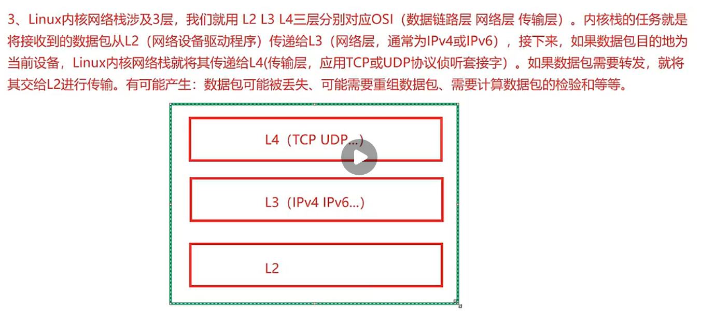
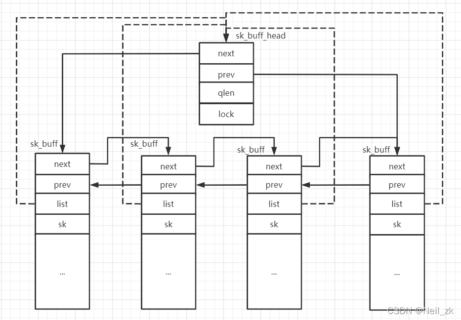
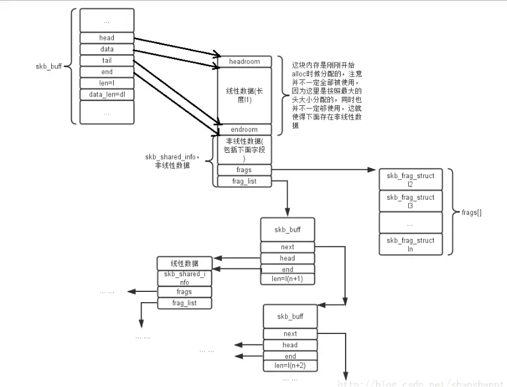

# 套接字源码分析
套接字不仅可以用于各种传输协议的IP连接，也可以用于内核支持的所有其他地址和协议类型,IPX、Appletalk、本地UNIX套接字/ TCP/UDP
Linux网络核心架构分为三层：用户空间的应用层，内核空间的网络协议栈层，物理硬件层。其中最重要的核心是内核空间的协议格层。在整个栈按照严格分层设计思想可分为五层：系统调用接口层——＞协议无关的接口层——＞网络协议实现层——＞驱动接口层——＞驱动程序层。


(1.) 重要结构体定义： include/linux/socket.h
```c
struct sockaddr {
      sa_family_t sa_family;  /* address family, AF_xxx   */
      char        sa_data[14];    /* 14 bytes of protocol address */
  };

 clude/uapi/linux/in.h 
 struct sockaddr_in{
   short sin_family;
   unsigned short sin_port;
   struct in_addr sin_addr;
......
}

struct sockaddr_in server;-->(struct sockaddr*)&server
通常在用户态程序需要赋值sockaddr_in，调用系统调用时转换为sockaddr.

```

(2.) IP地址重要接口函数
```c
//点分十进制（IPv4）或冒号分隔十六进制（IPv6）表示的 IP 地址转换为二进制形式
in_addr_t inet_addr(const char *cp);//废弃
int inet_pton(int af, const char *src, void *dst);

//二进制形式-->点分十进制（IPv4）或冒号分隔十六进制（IPv6）
const char *inet_ntop(int af, const void *src, char *dst, socklen_t size);
```
(3.) USER Space--> socket(c library)-->system call(API)-->kerel socket API-->call serveral layer API
 socket(c library) in <sys/socket.h>
  system call-->arch/arm64/include/asm/unistd32.h
  


## 内核接收网络包（设备层）
网卡作为一个硬件接收到网络包。处理刚才高效接受数据，减少对CPU的中断次NAPI，eg :在网卡驱动程序初始化的时候，就会调用ixgb＿init＿module（注册一个驱动ixgb＿driver）


## 套接字缓冲区（socket buffer）skbuff



```c
struct sk_buff {
	/* These two members must be first. */
	struct sk_buff		*next;
	struct sk_buff		*prev;

	ktime_t			tstamp; //rev/send time

	struct sock		*sk; //send/rev user sock point, NULL if forward
	struct net_device	*dev; //device object(may virsual dev)
	struct net_device	*real_dev;	/* For support of point to point protocols 
						   (e.g. 802.3ad) over bonding, we must save the
						   physical device that got the packet before
						   replacing skb->dev with the virtual device.  */

	int  outdev; 
	int  indev;				/* Original interface */
	
	/*
	 * This is the control buffer. It is free to use for every
	 * layer. Please put your private variables there. If you
	 * want to keep them across layers you have to do a skb_clone()
	 * first. This is owned by whoever has the skb queued ATM.
	 */
	char			cb[160] __aligned(8);

	unsigned int		len,
				data_len;
	__u16			mac_len,
				hdr_len;
	
	__be16			protocol;

	void			(*destructor)(struct sk_buff *skb);

	int			skb_iif;
	__u32			rxhash;

	__u16			queue_mapping;
	sk_buff_data_t		transport_header;
	sk_buff_data_t		network_header;
	sk_buff_data_t		mac_header;
	/* These elements must be at the end, see alloc_skb() for details.  */
	sk_buff_data_t		tail;
	sk_buff_data_t		end;
	unsigned char		*head,
				*data;
	unsigned int		truesize;
	atomic_t		users;
	struct ip_tuple *iptp;
	int		pxmit;
	struct ip6_tuple *iptp6;
	struct ips_sa_data * ips_sa; /*  &ips_sa.ct_general  */
	struct virtual_firewall *vf;
	unsigned int skb_vrf;
	struct mac_host *host;
	__u32 dos_id;
	__u32 ips_view_id;
	struct ha_profile ha;
	// for ip flow trace
	__u32 trace_id;
	__u32 trace_flag;

	__u16 socktype;
	__u16 sockport;
	unsigned short vlanid;
	unsigned char vlan_cos;
	unsigned char tos; /* DSCP value for L3 header */
	/* transmit hash value for link aggregation slave selection*/
	__u8	bond_xmit_hash;

	unsigned int addr_generation;
	int skb_pmtu;
	struct multi_class_shaper *ingress_shaper;
	__u8	class_id;
	unsigned int qdisc_pkt_len;
	struct skb_prp_trailer prp_trailer; //Parallel Redundancy Protocol
};
```
## 套接字缓冲区关系图


## 套接字缓冲区API
TO do list 

## net_device 设备对象结构
include/linux/netdevice.h
net_device结构体存储着网络设备的所有信息，每个设备都有这种结构。所有设备的net_device结构放在一个全局变量dev_base所有全局列表中。和sk_buff一样，整体结构相当庞大的。结构体中有一个next指针，用来连接系统中所有网络设备。内核把这些连接起来的设备组成一个链表，并由全局变量dev_base指向链表的第一个元素。
网络设备net_device结构体包含主要设备参数
设备的IRQ号、设备的MTU、设备的MAC地址、设备的名称(eth1,ethO)、设备的标志(up,down)、与设备相关
联的组播地址清单、设备支持的功能、网络设备回调函数的对象(net_device_ops).设备最后一次发送数据包的时
间戳、设备最后一次接收数据包的时间戳。

net_device结构体具体源码
分析如下：

```c
struct net_device {

	/*
	 * This is the first field of the "visible" part of this structure
	 * (i.e. as seen by users in the "Space.c" file).  It is the name
	 * of the interface.
	 */
	char			name[IFNAMSIZ];
	char			fs_name[IFNAMSIZ];
	/* device name hash chain */
	struct hlist_node	name_hlist;
	char 			*ifalias; 	/* interface alias */
	/*
	 *	I/O specific fields
	 *	FIXME: Merge these and struct ifmap into one
	 */
	unsigned long		mem_end;	/* shared mem end	*/
	unsigned long		mem_start;	/* shared mem start	*/
	unsigned long		base_addr;	/* device I/O address	*/
	unsigned int		irq;		/* device IRQ number	*/

	unsigned long		state;

	struct list_head	dev_list; //global dev list
	struct list_head	napi_list; // from 2.6.x support
	struct list_head	unreg_list;// unreg global list

	/* currently active device features */
	u32			features; 
	u32			features_ex;
	/* user-changeable features */
	u32			hw_features;
	/* user-requested features */
	u32			wanted_features;
	/* mask of features inheritable by VLAN devices */
	u32			vlan_features;
	
	/* Interface index. Unique device identifier	*/
	int			ifindex;
	int			iflink; // peer virtual tunnel device
	int			phyindex;

	struct net_device_stats	stats;
	atomic_long_t		rx_dropped; /* dropped packets by core network
					     * Do not use this in drivers.
					     */
	/* Management operations */
	const struct net_device_ops *netdev_ops;
	const struct ethtool_ops *ethtool_ops;

	/* Hardware header description */
	const struct header_ops *header_ops;

	unsigned int		flags;	/* interface flags (a la BSD)	*/
	unsigned int		priv_flags; /* Like 'flags' but invisible to userspace. */
	unsigned short		gflags;
	unsigned short		padded;	/* How much padding added by alloc_netdev() */

	unsigned char		operstate; /* RFC2863 operstate */
	unsigned char		link_mode; /* mapping policy to operstate */

	unsigned char		if_port;	/* Selectable AUI, TP,..*/
	unsigned char		dma;		/* DMA channel		*/

	unsigned int		mtu;	/* interface MAC MTU value		*/
	unsigned short		type;	/* interface hardware type	*/
	unsigned short		hard_header_len;	/* hardware hdr length	*/

	/* Interface address info. */
	unsigned char		perm_addr[MAX_ADDR_LEN]; /* permanent hw address */
	unsigned char		addr_assign_type; /* hw address assignment type */
	unsigned char		addr_len;	/* hardware address length	*/
	unsigned short          dev_id;		/* for shared network cards */

	spinlock_t		addr_list_lock;
	struct netdev_hw_addr_list	uc;	/* Unicast mac addresses */
	struct netdev_hw_addr_list	mc;	/* Multicast mac addresses */
	bool			uc_promisc; //Unicast dev model
	unsigned int		promiscuity; //model
	unsigned int		allmulti; // multicast model
	struct in_device __rcu	*ip_ptr;	/* IPv4 specific data	*/
	struct dn_dev __rcu     *dn_ptr;        /* DECnet specific data */
	struct inet6_dev __rcu	*ip6_ptr;       /* IPv6 specific data */
	struct vlan_range_list __rcu 	*vlan_filter_ptr;	/* vlan filter specific data for virtual wire pair*/
	void			*ec_ptr;	/* Econet specific data	*/
	unsigned long		last_rx;	/* Time of last Rx
						 * This should not be set in
						 * drivers, unless really needed,
						 * because network stack (bonding)
						 * use it if/when necessary, to
						 * avoid dirtying this cache line.
						 */

	struct net_device	*master; /* Pointer to master device of a group,
					  * which this device is member of.
					  */
	/* Interface address info used in eth_type_trans() */
	unsigned char		*dev_addr;	/* hw address, (before bcast
						   because most packets are
						   unicast) */

	struct netdev_hw_addr_list	dev_addrs; /* list of device
						      hw addresses */

	unsigned char		dst_addr[MAX_ADDR_LEN];
	unsigned char		broadcast[MAX_ADDR_LEN];	/* hw bcast add	*/

	rx_handler_func_t __rcu	*rx_handler;
	void __rcu		*rx_handler_data;

	struct netdev_queue __rcu *ingress_queue;

/*
 * Cache lines mostly used on transmit path
 */
	struct netdev_queue	*_tx ____cacheline_aligned_in_smp;

	/* Number of TX queues allocated at alloc_netdev_mq() time  */
	unsigned int		num_tx_queues;

	/* Number of TX queues currently active in device  */
	unsigned int		real_num_tx_queues;

	/* root qdisc from userspace point of view */
	struct Qdisc		*qdisc;

	unsigned long		tx_queue_len;	/* Max frames per queue allowed */
	spinlock_t		tx_global_lock;

#ifdef CONFIG_XPS
	struct xps_dev_maps __rcu *xps_maps;
#endif

	/* These may be needed for future network-power-down code. */

	/*
	 * trans_start here is expensive for high speed devices on SMP,
	 * please use netdev_queue->trans_start instead.
	 */
	unsigned long		trans_start;	/* Time (in jiffies) of last Tx	*/

	int			watchdog_timeo; /* used by dev_watchdog() */
	struct timer_list	watchdog_timer;

	int			linkdown_timeo;
	struct timer_list	linkdown_timer;

	/* Number of references to this device */
	int __percpu		*pcpu_refcnt;

	/* delayed register/unregister */
	struct list_head	todo_list;
	/* device index hash chain */
	struct hlist_node	index_hlist;

	struct list_head	link_watch_list;

	/* register/unregister state machine */
	enum { NETREG_UNINITIALIZED=0,
	       NETREG_REGISTERED,	/* completed register_netdevice */
	       NETREG_UNREGISTERING,	/* called unregister_netdevice */
	       NETREG_UNREGISTERED,	/* completed unregister todo */
	       NETREG_RELEASED,		/* called free_netdev */
	       NETREG_DUMMY,		/* dummy device for NAPI poll */
	} reg_state:8;

	bool dismantle; /* device is going do be freed */

	enum {
		RTNL_LINK_INITIALIZED,
		RTNL_LINK_INITIALIZING,
	} rtnl_link_state:16;

	/* Called from unregister, can be used to call free_netdev */
	void (*destructor)(struct net_device *dev);

#ifdef CONFIG_NET_NS
	/* Network namespace this network device is inside */
	struct net		*nd_net;
#endif

	/* mid-layer private */
	union {
		void				*ml_priv;
		struct pcpu_lstats __percpu	*lstats; /* loopback stats */
		struct pcpu_tstats __percpu	*tstats; /* tunnel stats */
		struct pcpu_dstats __percpu	*dstats; /* dummy stats */
	};
	/* GARP */
	struct garp_port __rcu	*garp_port;

	/* class/net/name entry */
	struct device		dev;
	/* space for optional device, statistics, and wireless sysfs groups */
	const struct attribute_group *sysfs_groups[4];

	/* rtnetlink link ops */
	const struct rtnl_link_ops *rtnl_link_ops;

	/* for setting kernel sock attribute on TCP connection setup */
#define GSO_MAX_SIZE		65536
	unsigned int		gso_max_size;

#ifdef CONFIG_DCB
	/* Data Center Bridging netlink ops */
	const struct dcbnl_rtnl_ops *dcbnl_ops;
#endif
	u8 num_tc;
	struct netdev_tc_txq tc_to_txq[TC_MAX_QUEUE];
	u8 prio_tc_map[TC_BITMASK + 1];

#if defined(CONFIG_FCOE) || defined(CONFIG_FCOE_MODULE)
	/* max exchange id for FCoE LRO by ddp */
	unsigned int		fcoe_ddp_xid;
#endif
	/* phy device may attach itself for hardware timestamping */
	struct phy_device *phydev;

	/* group the device belongs to */
	int group;

/*---------------------fortinet---------------------------*/
	unsigned int		fw_flags; /* if 1 substitution is enabled */
	unsigned long		last_log;	/* Time of last over shapping log */
	/* bridge stuff */
	struct{
		rwlock_t ctx_lock;
		struct net_bridge_port __rcu *ctx_br_port;
		struct vlan_group *	ctx_vlan_grp;
	}if_ops_ctx;
#define if_ops_lock if_ops_ctx.ctx_lock
#define br_port if_ops_ctx.ctx_br_port
#define vlan_grp if_ops_ctx.ctx_vlan_grp
#ifdef CONFIG_SW_NET
	void *vsdev_priv;
#endif
	struct if_ops 		*ops;

	struct list_head 	vf_link;
	struct virtual_firewall __rcu *dev_vf;
	int 			arp_entry;
	int 			ha_flags;
	unsigned int	mgmt_ip;

	struct list_head	notif_list;
#ifdef CONFIG_NET_NPU
	unsigned int npu_disable;
	unsigned int oid;
	u_int16_t oid_vid;
	struct npu_netdev_ops *npu_ops;
#endif
	u_int16_t rx_tcp_mss;
	u_int16_t tx_tcp_mss;
	struct dev_traffic_shaper in_shaper;
	struct multi_queue_shaper out_shaper;
	struct multi_class_shaper __rcu *in_cls_shaper;
	struct multi_class_shaper __rcu *out_cls_shaper;
	struct rtnl_link_stats64 base_stats;
	struct net_dev_bps bps;
	struct net_dev_bps ingress_bps;
	struct net_dev_sampler sampler;
	u_int32_t vrf;
	u_int16_t vwl_zone_id;
	u_int16_t vwl_intf_quality;
	int weight;
};
```
## 网络设备中NAPI工作模式
老式的网络设备工作在中断模式下面，每接受到一个包就中断一次，效率比较低，为此解决这个问题，开发一种新的软件技术-->NAPI (NewAPI) ₒ采用NAPI技术时，如果负载很高，网络设备驱动程序将在轮询模式，而不是中断驱动模式下运行。--2.6版本引入的。
[Title](user_kernel_api.md)
 1.）数据包的收发：网络设备驱动程序主要任务：接收目的地为当前主机的数据包，并将其传递给网络层，之后再将其传递给
才专输层。传输当前主机生成的外出数据包或转换当前主机收到数据包。对于每个数据包，无论它是接收到还是发送出去，
:都需要在路由子系统中执行一次查找操作。
2.）当数据包位于网络设备驱动程序接收路径的L2时，skb->data指向的是L2(以太网)报头；调用方法eth_type_trans()后，
激据包即将进入第3层，因此skb->data应指向网络层(L3)报头，而这个报头紧跟在以太网报头后面。


